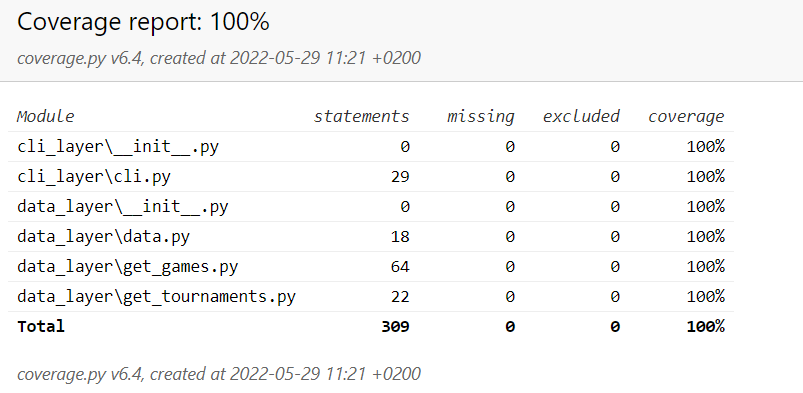

# SportRadar Coding Challenge

## Tasks

* Implement a middleware that returns information about the last five sport matches with normalized data. The application interface can be used in various widgets that offer short statistics.
* Create a widget that displays the data from above.

## Implementation

### Data layer

*requests* Python library is used to retrieve data from the API.
First, data about all available tournaments is extracted.
Then for each tournament its own API is called to retrieve the data for matches.

### CLI layer

Data is shown to the user using the Command Line Interface (CLI). *click* Python library is used for that.

### Communication

Data layer returns JSON-formatted data which CLI layer accepts and deserializes it to the user-friendly format.


## Testing

*pytest* Python library is used. 100% coverage is achieved.



## How to use

### Prerequisites

* Some computer
* Python installed on it

### Steps to follow

* Clone the repo into your machine
* (Optional) Create and activate Python virtual environment:
  * ```python3 -m venv env```
  * ```env\Scripts\activate``` or ```source env/bin/activate``` if you are using Mac
* Install required libraries:
  * ```pip install -r requirements.txt```
* Run the script:
  * ```./cli_layer/cli.py```
